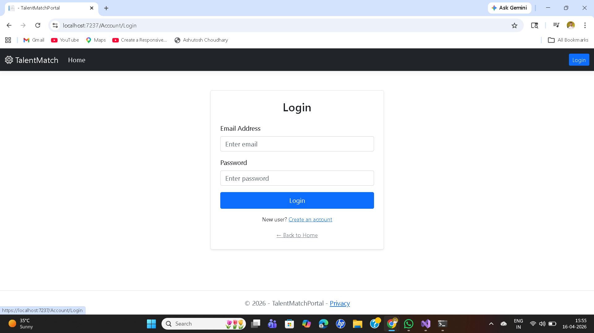
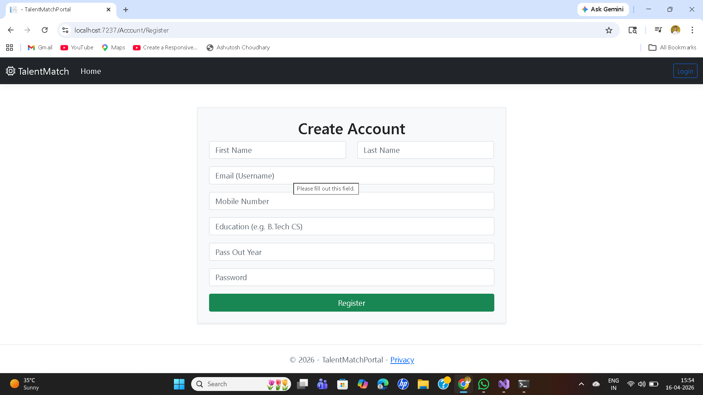
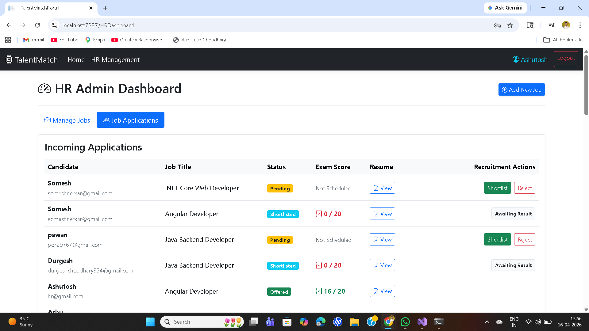
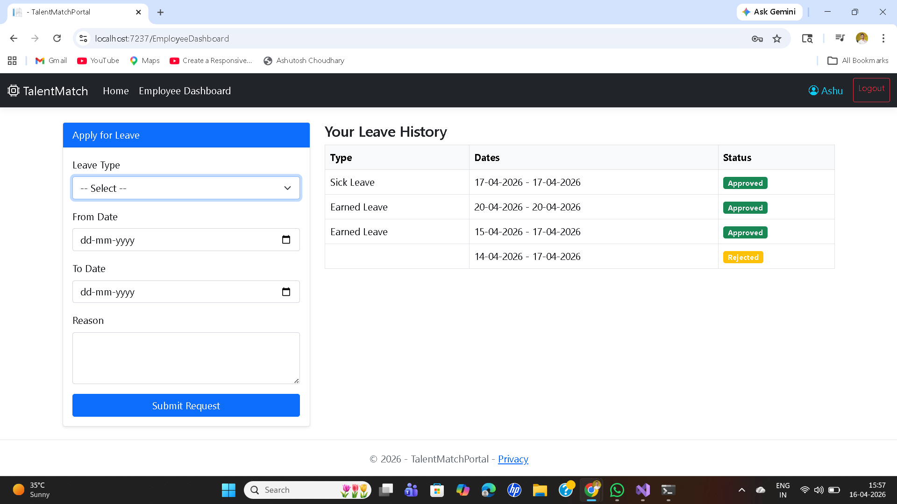
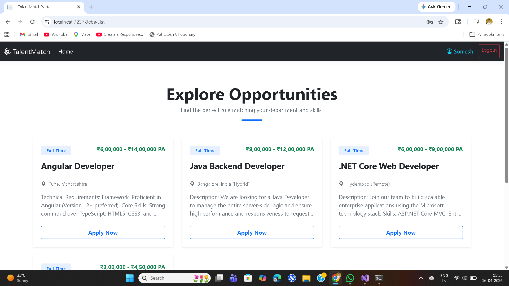
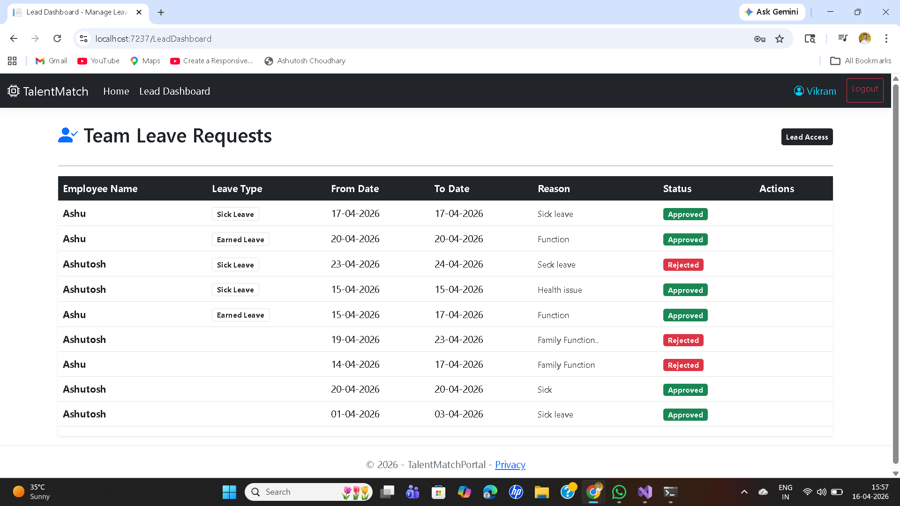

# TalentMatchPortal 🚀

A comprehensive Recruitment and Employee Management System built with **ASP.NET Core MVC** and **SQL Server**.

## 🌟 Key Features
- **Multi-Role Authentication:** Custom dashboards for HR, Leads, and Employees.
- **Recruitment Pipeline:** Job posting, candidate tracking, and application management.
- **Leave Management System:** Integrated workflow where Leads approve/reject leaves with automated balance deduction.
- **Role-Based Access Control (RBAC):** Secure navigation and data protection based on user roles.

## 🛠️ Tech Stack
- **Backend:** C#, ASP.NET Core MVC, Entity Framework Core
- **Database:** SQL Server
- **Frontend:** Bootstrap 5, Razor Pages, jQuery
- **Architecture:** Repository Pattern & Dependency Injection

## 🚀 How to Run
1. Clone the repository.# TalentMatchPortal 🚀

A robust Recruitment and Employee Management System built with **ASP.NET Core MVC** and **SQL Server**. This platform streamlines the hiring process and internal employee management through a secure, role-based architecture.

## 🌟 Key Features

- **Multi-Role Dashboards:** Distinct interfaces for **HR**, **Team Leads**, and **Employees**.
- **Role-Based Access Control (RBAC):** Secure navigation and data protection using Session and Cookie-based authentication.
- **Recruitment Pipeline:** Job posting, candidate tracking, and application status management.
- **Leave Management System:** Integrated workflow where Leads can approve or reject leave requests with automated balance deduction.
- **Data Integrity:** Real-time updates for employee leave balances and application scores.

---

## 📸 Project Preview

### 🔑 Access & Security
| Login Interface | Secure Registration |
|---|---|
|  |  |

### 📊 Management Dashboards
| HR Recruitment Management | Employee Dashboard |
|---|---|
|  |  |

### 📝 Core Workflow
| Job Opportunity Portal | Admin/Lead View |
|---|---|
|  |  |

---

## 🛠️ Tech Stack

- **Backend:** C#, ASP.NET Core 8.0 MVC
- **Database:** SQL Server (SSMS)
- **Data Access:** Entity Framework Core (EF Core)
- **Design Pattern:** Repository Pattern & Dependency Injection
- **Frontend:** HTML5, CSS3, Bootstrap 5, JavaScript/jQuery
- **Security:** Session Management & Anti-Forgery Tokens

---

## 🏗️ Architecture & Logic

- **Dependency Injection:** Utilized for `ApplicationDbContext` to ensure loose coupling and better testability.
- **MVC Pattern:** Separation of concerns between Models (Data), Views (UI), and Controllers (Logic).
- **Session Management:** Used to track user roles (`HR`, `Lead`, `Employee`) across the application to provide personalized experiences.

---

## 🚀 How to Run

1. **Clone the Repo:**
   ```bash
   git clone [https://github.com/Ashutosh-6263/TalentMatchPortal.git](https://github.com/Ashutosh-6263/TalentMatchPortal.git)
2. Update the `DefaultConnection` in `appsettings.json` with your SQL Server credentials.
3. Run `Update-Database` in the Package Manager Console.
4. Press `F5` to run the project.
